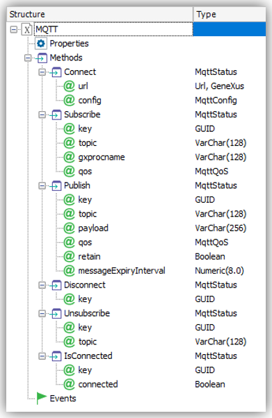
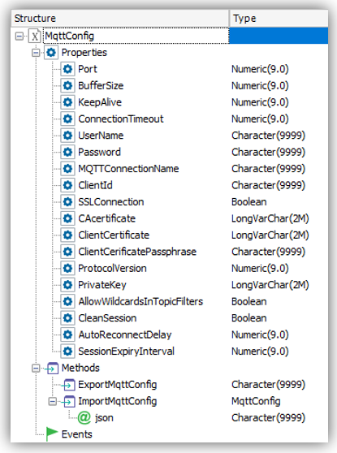
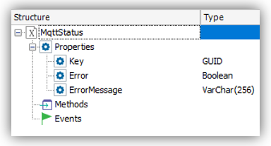

# MQTT External Object  


This repository holds the implementation of a GeneXus [External Object](https://wiki.genexus.com/commwiki/servlet/wiki?6148) that allows you to include MQTT events in your Knowledge Base.

=== As of August 2020, the implementation is only available for the .NET Framework generator ===

## How to use it

First import the [MQTT_EXO.xpz](https://github.com/genexuslabs/mqtt-external-object/releases) provided in this repository. This will import 3 different External Objects and a Domain.

You also need to include to the Knowledge Base the files provided in the [latest release](https://github.com/genexuslabs/mqtt-external-object/releases) of this repository. Unzip the MQTTLib.zip file and add the three contained files (BouncyCastle.Crypto.dll, MQTTLib.dll, and MQTTnet.dll ) into your Knowledge Base. Make sure you set the property [Extract for .Net Framework Generator](https://wiki.genexus.com/commwiki/servlet/wiki?39501) to **True** and [.Net Framework Extraction Directory](https://wiki.genexus.com/commwiki/servlet/wiki?39502) to **.\bin** for all of these files. 

The MQTT External Object is the one that holds the method for publishing and subscribing to MQTT events. 



The implementation is based on [MQTTnet](https://github.com/chkr1011/MQTTnet), *"a high performance .NET library for MQTT based communication."* 

### Connecting to an MQTT broker

The first thing you need to do, either for publishing or subscribing is to connect to the desired broker.

```genexus
&mqttStatus = MQTT.Connect(&url, &mqttConfig)
```

Where `&url` is the URL of the broker and `&mqttConfig` is an instance of the also provided `MqttConfig` External Object.  
The `MqttConfig` External Object has the needed properties to connect to your broker, whether you're using user and password or a certificate. Here are the properties that hold a default value.

Name|Default value
---|---
Port|1883
BufferSize|8192
KeepAlive|0
ConnectionTimeout|5
MQTTConnectionName|mqtt_connection1
SSLConnection|false
ProtocolVersion|500
CleanSession|true
AllowWildcardsInTopicFilters|false
AutoReconnectDelay|5
SessionExpiryInterval|0



### Publishing messages

The publish method receives a GUID, which is the Key of the `MqttStatus` after connecting, a topic, the message itself, the [Quality of Service](https://assetwolf.com/learn/mqtt-qos-understanding-quality-of-service) (there's a domain called MqttQoS), a boolean indicating if the message should be retained and a numeric stating the expiry of the message (in seconds)

```genexus
&mqttStatus = MQTT.Publish(&mqttguid,&topic, &message, MqttQoS.AtMostOnce, true,30)
```

Again, you'll get an instance of `MqttStatus` where you can check if everything went well.

### Subscribing to topics

To subscribe you need to call the Subscribe method which also receives the GUID of the connection, the topic you wish to subscribe to, the name of the Procedure that will be called once a message arrives, and again, the Quality of Service.

```genexus
&mqttStatus = MQTT.Subscribe(&mqttguid,&topic,"SaveMessage",MqttQoS.AtLeastOnce)
```

The GeneXus procedure to be called when a message arrives must comply with the following requirements.
1) Its [Main program property](https://wiki.genexus.com/commwiki/servlet/wiki?7407) must be set to **True**
2) The parm rule must be exactly as follows. First, a Varchar that will be the topic, the second parameter (also Varchar) will be the message body itself, and a third parameter (DateTime) that's the timestamp when the message was received by the client. This DateTime is generated on the subscriber.

```genexus
parm(in:&topic,in:&message,in:&dateTime);
```

Once a message for the subscribed topic is received, the Procedure will be called asynchronously. You will not have a status back from the execution unless you write the code yourself in your procedure.

### Unsubscribing

You can also unsubscribe from a specific topic. All you need is the GUID of the connection and the topic you wish to unsubscribe to.

```genexus
&mqttStatus = MQTT.Unsubscribe(&mqttguid,&topic)
```

### Disconnecting

To disconnect an established connection all you have to do is sending the connection GUID.

```genexus
&mqttStatus = MQTT.Disconnect(&mqttguid)
```

There's also an `IsConnected` method that receives the GUID of the connection and a Boolean as an out parameter that will hold whether the connection is active or not.

```genexus
&mqttStatus = MQTT.IsConnected(&mqttguid,&connected)
```

In every case, the returned `&mqttStatus` is an instance of the `MqttStatus` External Object that holds a `Key` (GUID), an `Error` (Boolean) and an `ErrorMessage` (VarChar) in case Error is True.




## Testing

There are a couple of projects in the solution used for testing purposes. If you wish to thes the implementation in Visual Studio, make sure you add an `App.config` file under the [Subscriber](./tests/Subscriber) folder with the following structure:

```xml
<?xml version="1.0" encoding="utf-8" ?>
<configuration>

	<appSettings>
		<add key="url" value=""/>
		<add key="user" value=""/>
		<add key="password" value=""/>
		<add key="topic" value=""/>
		<add key="passphrase" value=""/>
		<add key="caCertificate" value=""/>
		<add key="clientCertificate" value=""/>
	    <add key="privateKey" value=""/>
	</appSettings>

	<startup>
		<supportedRuntime version="v4.0" sku=".NETFramework,Version=v4.7.2" />
	</startup>
</configuration>
```

Also, there's an application called [MQTT Box](https://www.microsoft.com/en-us/p/mqttbox/9nblggh55jzg) which you can install from the Windows Store to test your solution.

